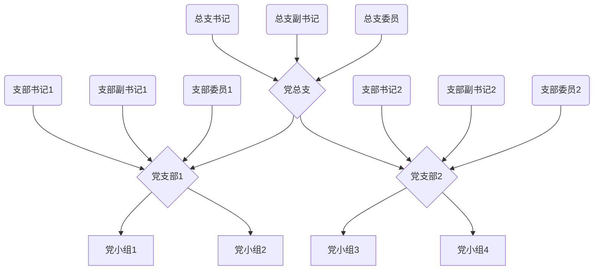

# 党建模块相关功能

## 党组织架构

### 总支和支部

总支委员会和支部委员会下设书记、副书记和委员，支部下分设党小组。

### 党小组

党小组管理网页，设置党小组，组长。党小组组长具有对应党建的权限。

数据库表cd_party_group

查询接口partygroup/partyGroup/list

### 党员信息

用户的党员信息。

数据库表cd_party_personal_info

查询接口partypersonalinfo/partyPersonalInfo/list

保存接口partypersonalinfo/partyPersonalInfo/submit

## 写实管理模块

### 写实记录

由党小组长负责对照“五项指标”，对党员进行日常“写实”考核，认真填写“写实”记录，客观真实记录党员现实表现，指出存在问题和扣分原因。

由党小组组长对自己小组的党员进行记录。记录包括日期，被记录党员，各项指标扣分和详细内容。

组长有自己党小组的创建和编辑记录权限，组员只能看自己的支部记录。

查看记录通过开始时间和截至时间进行筛选。以记录的日期为单条记录，每条记录中包括扣分和详细内容。

数据库表cd_party_diary_daily

查看接口partydiarydaily/partyDiaryDaily/list

创建和编辑接口partydiarydaily/partyDiaryDaily/submit

### 月评星

由党小组长根据当月“写实”情况，对照“五项指标”标准，对每名党员打分，并进行评星，确立支部月度“五星党员”

党员“写实”管理采取“千分制”，“政治、安全、任务、素质、和谐”“五项指标”中，每项指标满分200分

总分低于600分为“非星党员”，不参与评星定级；总分600——700分（含600分）为“一星”党员；总分700——800分（含700分）为“二星”党员；总分800——850分（含800分）为“三星”党员；总分850——900分（含850分）为“四星”党员；900——1000分（含900分）为“五星”党员。

### 季定级

由各支部书记根据“日写实”“月评星”情况，评出季度“党员先锋”

### 年评比

根据全年“写实”情况，对党员进行评先树优。评比周期为上年度7月1日至本年度6月30日。党总支根据季度“党员先锋”评比情况，按照不超过20%的比例，评选年度“昊盛先锋”，在“七一”期间予以表彰